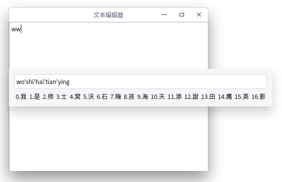

# Qt 海天鹰输入法
Linux 平台基于 Qt 的输入法程序，实验项目，仅供学习和参考，暂时无法输入汉字到其他窗口。  
已编译好的 HTYInput 程序适用64位Linux系统Qt5环境，双击运行，其他版本请自行编译。  

  

### 开发难点
#### 数据库选择及结构
选择本地小型数据库SQLite
#### 音节自动分割
输入 ````pinyinshurufa````，显示````pin'yin'shu'ru'fa````
#### 按音节选字