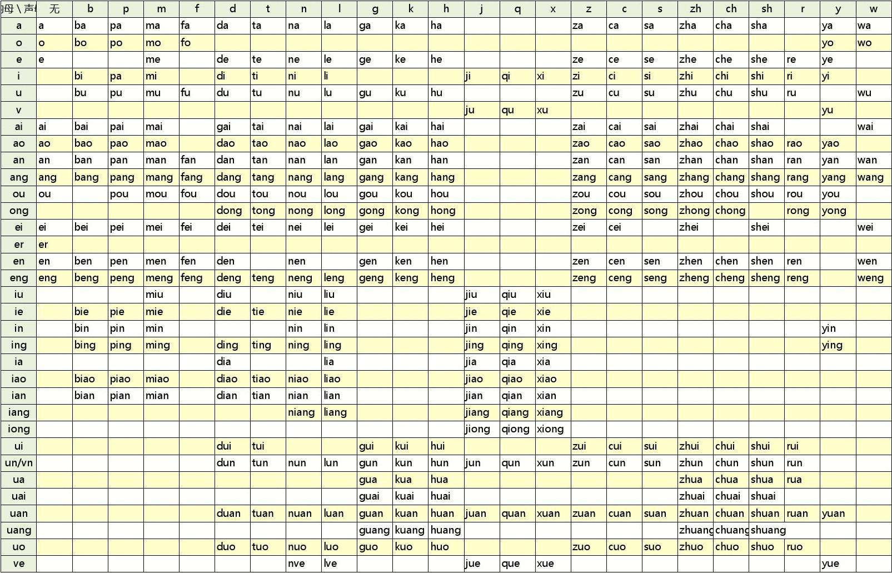

# Qt 海天鹰输入法
Linux 平台基于 Qt 的拼音输入法程序，实验项目，暂时无法输入汉字到其他窗口。  
已编译好的 HTYInput 程序适用 64 位 Linux 系统 Qt5 环境，双击运行，其他版本请自行编译。
  

### 参考
https://github.com/xiaoyanLG/ChineseInput
### 开发难点
#### 数据库选择及结构
选择本地小型数据库SQLite
#### 按键拦截及过滤
```
eventFilter(QObject *obj, QEvent *event) {
	QKeyEvent *KE = static_cast<QKeyEvent*>(event);  
	if (obj == TE && event->type() == QEvent::KeyPress) {  
		if (KE->key() >= Qt::Key_A && KE->key() <= Qt::Key_Z) {  
			...
		}
	}  
}
```
### 拼音基础：
声母、韵母  

#### 音节自动分割
输入 ```pinyinshurufa``` ，显示 ```pin'yin'shu'ru'fa``` 。
#### 按音节选字